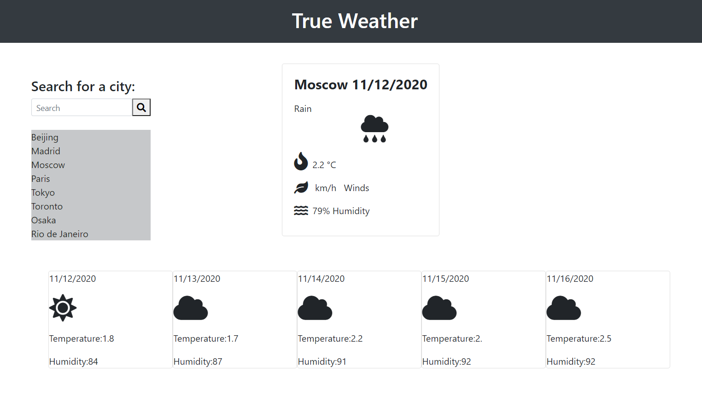

:part_alternation_mark:

# True-Weather-App
Dynamic Weather App - Live Updates
---
 

>Link to page https://mt2314.github.io/True-Weather-App/

## Job Requirements
---

 

AS A traveler
I WANT to see the weather outlook for multiple cities
SO THAT I can plan a trip accordingly

>Build a Weather App with Data Fecthed from API

>Display Updated Weather for multiple cities in the world

>Display Current Weather and 5 Day Weather

  
 

| Job Requirements                               | Solutions                                                                                       |
| ---------------------------------------------- | ----------------------------------------------------------------------------------------------- |
| WHEN I search for a city                   | THEN I am presented with current and future conditions for that city and that city is added to the search history  :heavy_check_mark:                                                          |
|WHEN I view current weather conditions for that city | THEN I am presented with the city name, the date, an icon representation of weather conditions, the temperature, the humidity, the wind speed, and the UV index:heavy_check_mark: |
| WHEN I view the UV index                 | THEN I am presented with a color that indicates whether the conditions are favorable, moderate, or severe:heavy_check_mark:                                                           |
| WHEN I view future weather conditions for that city            | THEN I am presented with a 5-day forecast that displays the date, an icon representation of weather conditions, the temperature, and the humidity:heavy_check_mark:                                                              |
| WHEN I click on a city in the search history                 | THEN I am again presented with current and future conditions for that city:heavy_check_mark:                                            

 
 

## Credits
---
:school: 
**University of Toronto Continuing Educationg
Full Stack Flex Program** - *Initial HTML and CSS*
:school:

:heart: 
*Students and Instructors At the UFT-FSF-2020-2021*
:heart:

:clock12:
Moment JS
:clock12:

:satellite:
Open Weather API
https://openweathermap.org/
:satellite:

 

## License
---

All rights reserved.

Licensed under the MIT license.
 

 

:lock::lock::lock::lock:

_____
____
___